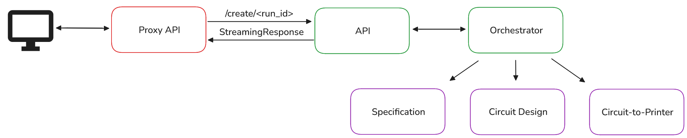

# Impromptu Documentation

Here you can find the documentation for **Impromptu**, an automatic end-to-end circuit prototyper.

## 📑 Table of Contents

- [Glossary](#glossary)
- [How Does Impromptu Work](#how-does-impromptu-work)
- [Adding Your Own Workflows](#adding-your-own-workflows)
- [FAQ](#faq)

## Glossary

**Agent**: LLM-based entity that completes tasks

**Tool**: non-LLM based entity that completes tasks

**Workflow**: collection of agents and tools chained together

**Orchestrator**: script that runs and manages workflows

**Executor**: script that sets up and runs an orchestrator

**Netlist**: [Spice](https://www.ecircuitcenter.com/Basics.htm)-based description of circuit components and connections

## How Does Impromptu Work?

*Fig. 1: Web App design*

Figure 1 shows the design diagram of our web app, which represents a typical way of using Impromptu. Users start by interacting with the frontend UI, which provides a ChatGPT-like interface. Users discuss their business needs with the LLM, enabling them to specify exactly what kind of product they'd like built. Once satisfied, the user clicks a button, which calls an API proxy that routes their request to our Python-based API. The reason we set it up this way is to avoid issues with [CORS](https://developer.mozilla.org/en-US/docs/Web/HTTP/Guides/CORS) and to simplify development.

*Fig. 2: Server-Sent Events flow*

In the POST request to the API, we include the user's discussion with the chatbot, their desired model-type (gpt-4o-mini, gpt-5, etc.), and any further context. This request isn't a typical synchronous API request. Instead, we use Server-Sent Events (SSE). As seen in Figure 2, this allows us to keep the connection with the frontend alive while we run a bunch of asynchronous tasks (like creating the circuit netlist and testing it). Specifically, we use a method named updateCallback, which gets passed to all of the workflows. When updateCallback is called, our SSE system sends an event to the frontend. Think of this as a "hey, I have something new to report!" So what exactly do we run when you call `/create/<run_id>`?

Our python logic immediately calls an executor, whose sole job is setup and start the orchestrator. The orchestrator, in turn, kicks off several workflows and ensures they are all working properly. The first workflow takes the user's request as an input and generates a formal specification (similar to the one you might see at an engineering firm). The second workflow takes this specification, and generates a circuit design. This circuit design is passed through a battery of tests to ensure its correctness, all of which are derived from industry-standard methods and tools. The final workflow involves setting up the circuit for printing. This involves routing and converting the finished circuit into printer instructions (GCode) that our pick-and-place machine can understand.

## Adding Your Own Workflows

Adding your own workflows is very straightforward. Create a new file in [workflows](../src/backend/workflows/), and add YourWorkflowClass that derives from our [BaseWorkflow](../src/backend/workflows/BaseWorkflow.py). Ensure you call the updateCallback when you first start your workflow, when the workflow ends, and anytime a major change occurs (e.g. stage completes or your workflow encounters an error). Once you've finished building your workflow, simply add it to the list of workflows called by the executor (either in [executor.py](../src/backend/executor.py) and/or [server.py](../src/backend/server.py), depending on if you want to add your workflow to the terminal version of Impromptu or the webapp). That's all! Use the existing workflows as a guide and open an issue if you are still running into errors.

## FAQ

**Question**: Why is Impromptu generating the same circuit repeatedly?

**Answer**: You may have mock (a setting used for testing that turns off the LLM) turned on. Check your [config](../src/backend/config.py).
